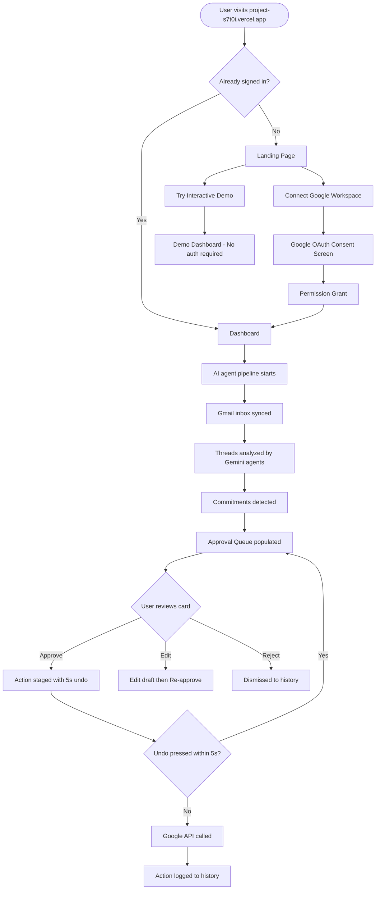
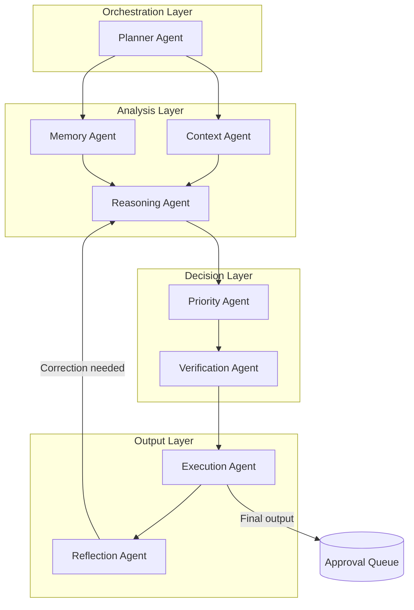
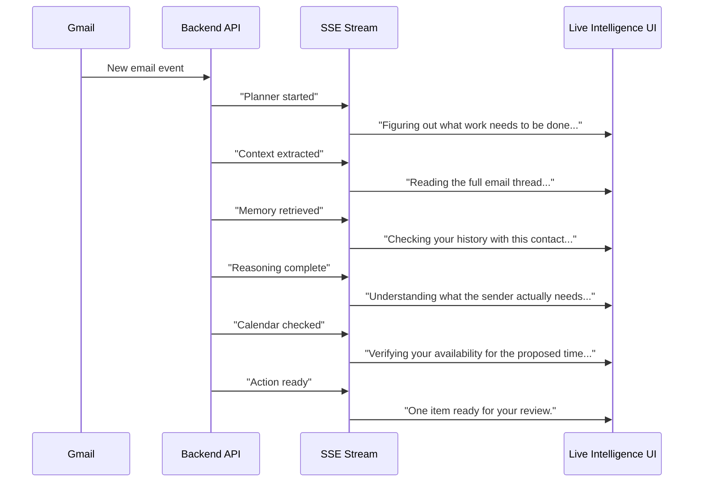
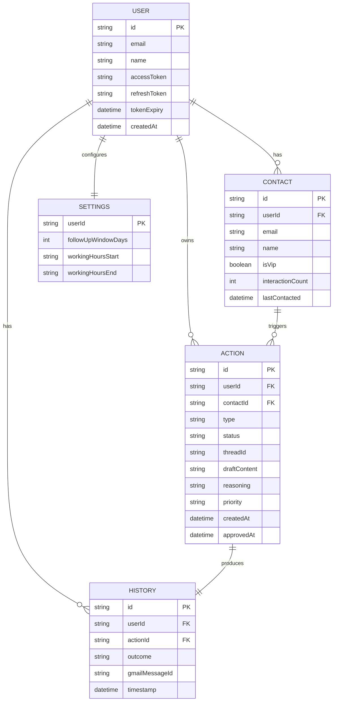

<div align="center">

# Oversight.ai

### The Executive Assistant That Lives Inside Your Inbox

**Google Gemini · Google Workspace · Next.js · TypeScript · AI Agents**

> _Stop dropping commitments. Let AI handle the overhead while you stay in control._

[](https://ai.google.dev)
[](https://nextjs.org)
[](https://typescriptlang.org)
[](https://project-s7t0i.vercel.app)

**Live Demo:** [project-s7t0i.vercel.app](https://project-s7t0i.vercel.app)

---

</div>

## Table of Contents

1. [Executive Summary](#executive-summary)
2. [Problem Statement](#problem-statement)
3. [Why This Problem Matters](#why-this-problem-matters)
4. [Solution](#solution)
5. [User Journey](#user-journey)
6. [Core Features](#core-features)
7. [AI Workflow](#ai-workflow)
8. [Multi-Agent Pipeline](#multi-agent-pipeline)
9. [Live Intelligence Layer](#live-intelligence-layer)
10. [Technical Architecture](#technical-architecture)
11. [Database Schema](#database-schema)
12. [API Reference](#api-reference)
13. [Google Technologies Used](#google-technologies-used)
14. [Why Google Gemini](#why-google-gemini)
15. [Security](#security)
16. [Privacy](#privacy)
17. [Screenshots](#screenshots)
18. [Demo Walkthrough](#demo-walkthrough)
19. [Future Roadmap](#future-roadmap)
20. [Judge Mapping](#judge-mapping)
21. [Challenges Faced](#challenges-faced)
22. [Lessons Learned](#lessons-learned)
23. [Conclusion](#conclusion)

---

## Executive Summary

Oversight.ai is an **autonomous AI system** that continuously monitors your Gmail inbox and Google Calendar, identifies commitments and follow-ups embedded in email threads, drafts appropriate responses or calendar events, and surfaces them in a unified approval queue — waiting for a single click from you before executing anything.

It is not a chatbot. It does not require you to prompt it. It is not a Chrome extension or a filter rule. It is a living, reasoning system that reads the full context of your professional communications and acts as a highly attentive executive assistant.

### The Problem It Solves

Professionals at every level lose hours every week managing email. But the cost is not just time — it is **missed commitments**. An investor follow-up buried under newsletters. A scheduling request that arrived at 11 PM and was forgotten by morning. A deadline agreed to in reply #7 of a 12-message thread that no one tracked. These are the gaps that Oversight.ai closes.

### Who It Is For

- Founders, executives, and senior managers with high-volume inboxes
- Anyone who communicates commitments through email and struggles to track them
- Teams who want to automate scheduling overhead without losing control
- Individuals exploring productive, human-in-the-loop AI automation

### Value Proposition

> **Oversight.ai transforms your inbox from a source of anxiety into a managed queue of pre-approved actions, giving you full control without any of the manual overhead.**

---

## Problem Statement

### The Reality of a Modern Inbox

The average professional receives over 120 emails per day. Of those, a significant percentage contain implied or explicit commitments:

- **"Let's connect next week"** — A meeting that may never get scheduled
- **"Can you send over those numbers by Friday?"** — A deadline that will be forgotten
- **"I'll follow up with the contract tomorrow"** — A promise with no reminder system

Email clients have remained fundamentally unchanged for two decades. They are designed for **reading and writing messages**, not for **tracking commitments and executing workflows**.

### Why Current Tools Fail

| Tool Category | What It Does | Why It Falls Short |
|---|---|---|
| Email filters / labels | Organizes messages by rule | Does not understand context or intent |
| Task managers (Todoist, Notion) | Tracks tasks manually created | Requires manual extraction from email |
| CRMs (Salesforce, HubSpot) | Logs customer interactions | Requires manual entry; built for sales |
| Smart reply (Gmail) | Suggests one-line replies | No scheduling, no commitment tracking |
| AI chatbots (ChatGPT, Claude) | Answers questions on demand | Not persistent; requires manual copy-paste |
| Calendar assistants | Schedules meetings | Operates only on calendar, not email |

### Specific Failure Scenarios

**Scenario 1: The forgotten investor follow-up**
A founder receives an email from a warm lead at 9 PM: "Interesting deck — let's reconnect Thursday or Friday." The founder reads it, means to reply in the morning, and by 9 AM has 34 new messages on top of it. The investor moves on.

**Scenario 2: The missed deadline**
A client replies to a proposal thread: "Looks good, we need the final version by end of month." The reply is buried 6 levels into a thread. No task is created. The deadline is missed.

**Scenario 3: The double-booked VIP**
A VP of Sales accepts a customer demo request via email. Her assistant forwards a different meeting to the same slot three days later. She does not notice until the day of.

---

## Why This Problem Matters

### Revenue at Risk

Missed follow-ups in sales contexts have a direct, measurable cost. Studies consistently show that **80% of sales require at least 5 follow-up touchpoints**, yet **44% of salespeople give up after one follow-up**. The gap is not motivation — it is tooling.

### Customer Satisfaction

In professional services, missed commitments erode trust. A single forgotten deadline or unreturned email can end a client relationship.

### Founder and Executive Productivity

Early-stage founders and senior leaders spend a disproportionate amount of time managing communication overhead. Every hour spent manually triaging email is an hour not spent on strategy, product, or relationships.

### Cognitive Load and Mental Fatigue

The anxiety of "Did I forget something?" is itself a productivity tax. Oversight.ai eliminates this by providing a provably complete view of outstanding commitments at all times.

---

## Solution

Oversight.ai is deployed as a web application that a user connects to their Google Workspace account via OAuth. Once connected, it runs a persistent monitoring pipeline that processes new emails as they arrive.

### How It Works

1. **You connect once.** You authorize Oversight.ai to read your Gmail and Calendar via Google OAuth. This takes 30 seconds.

2. **It monitors continuously.** The system reads incoming emails, fetches the full thread context, and analyzes them using a multi-agent AI pipeline.

3. **It finds commitments.** The AI identifies meetings to schedule, replies to draft, follow-ups that are overdue, deadlines that were accepted, and contact relationships that are important.

4. **It stages actions.** Instead of acting immediately, it creates a card in your **Approval Queue** with a plain-English summary of what it proposes to do and why.

5. **You approve with one click.** Every action requires your explicit approval before it executes.

6. **It executes precisely.** Approved actions are sent to the Google API and logged to your history.

7. **You can undo anything.** You have a 5-second window to undo every approved action before it hits the network.

### The Key Principle

> **Nothing in Oversight.ai executes without explicit human approval.** The AI is a preparation engine, not an automation engine.

---

## User Journey



| Step | What Happens | User Experience |
|---|---|---|
| **Landing** | User sees product explanation and dual CTA | Chooses between real workspace or demo |
| **Google OAuth** | Standard Google consent screen | Reviews permissions, clicks Accept |
| **Inbox Sync** | AI pipeline reads recent emails | Brief loading state |
| **AI Analysis** | 6-agent pipeline runs on each thread | Live Intelligence Layer shows progress |
| **Approval Queue** | Cards appear for each recommended action | User reviews AI reasoning |
| **Approve** | Action enters 5-second undo window | Toast notification with Undo button |
| **Execution** | API call to Gmail / Calendar | Immediate confirmation |
| **History** | Action logged with full context | Auditable timeline |

---

## Core Features

### AI Inbox Analysis

The system reads every incoming email thread in its entirety — not just the most recent message. It extracts sender relationships, conversation history, tone, urgency, and embedded commitments.

### Commitment Detection

Using reasoning from Google Gemini, the system identifies explicit and implied commitments:

- **Explicit**: "I'll send you the report by Friday."
- **Implied**: "Let's plan to meet before the end of Q3."
- **Received**: "Could you review this before Thursday?"

Each detected commitment is tracked until it is resolved or dismissed.

### Follow-up Detection

The system scans your sent mail to identify threads where you promised to follow up but have not, or where a reply was expected and has not arrived.

### Meeting Scheduling

When a scheduling request is detected, the system extracts proposed times, checks your Google Calendar for conflicts, drafts a confirmation reply, and creates a calendar event draft — all pending your approval.

### Draft Replies

The AI composes contextually appropriate reply drafts using the full thread history. Drafts follow the tone and style of the existing conversation. They are never sent without approval.

### Calendar Conflict Detection

Before proposing any meeting time, the system checks for existing events, back-to-back meeting density, and VIP contact priority.

### VIP Recognition

The system learns from your communication patterns which contacts receive fast replies and which threads you never ignore. These contacts are flagged as VIPs and surfaced with higher priority.

### Context Awareness

Every action card includes a **full reasoning trace** — why the AI believes this action is warranted, what context it used, and what alternatives were considered.

### Approval Queue

The central UI of Oversight.ai. A clean, prioritized list of pending actions. Each card shows the proposed content, the reasoning, and Approve / Edit / Reject buttons.

### Undo Support

Approving an action triggers a 5-second countdown toast. During this window, no API calls are made. Clicking Undo returns the action to the queue.

### History

A complete audit log of every action taken — approved, rejected, or undone. Every entry includes the original context and AI reasoning.

### Live Intelligence Layer

A persistent, floating UI component that explains in real-time what the AI pipeline is doing. See [Live Intelligence Layer](#live-intelligence-layer).

### Interactive Demo Mode

A fully functional, no-auth-required experience at `/demo`. Uses realistic pre-populated data to demonstrate the complete AI workflow. Ideal for judges and prospective users.

---

## AI Workflow

```mermaid
flowchart LR
    A[New Email Arrives] --> B[Thread Fetched\nfrom Gmail API]
    B --> C[Full Context\nExtracted]
    C --> D[Planner Agent\ndecomposes task]
    D --> E[Context Agent\nreads full thread]
    E --> F[Memory Agent\nretrieves contact history]
    F --> G[Reasoning Agent\ninfers intent]
    G --> H[Priority Agent\nscores urgency]
    H --> I[Calendar Agent\nchecks availability]
    I --> J[Verification Agent\nvalidates recommendation]
    J --> K[Execution Agent\nprepares draft action]
    K --> L[Approval Queue Card Created]
    L --> M{User Decision}
    M -->|Approve| N[5s Undo Window]
    N -->|Confirmed| O[Google API Called]
    M -->|Edit| L
    M -->|Reject| P[Dismissed to History]
```



| Stage | Component | Input | Output | Purpose |
|---|---|---|---|---|
| **Ingestion** | Gmail API | Raw email event | Full thread JSON | Fetch complete conversation context |
| **Planning** | Planner Agent | Thread JSON | Task list | Break work into parallelizable subtasks |
| **Context** | Context Agent | Full thread | Structured summary | Extract facts, tone, commitments, participants |
| **Memory** | Memory Agent | Sender email | Contact history | Retrieve past interactions and relationship |
| **Reasoning** | Reasoning Agent | Summary + history | Intent inference | Determine what the sender actually needs |
| **Priority** | Priority Agent | Intent + contact | Priority score | Weight by VIP status, deadline proximity |
| **Verification** | Verification Agent | Full state | Conflict check | Cross-reference calendar, detect duplicates |
| **Execution** | Execution Agent | Verified recommendation | Draft action | Compose reply, calendar event, or reminder |
| **Approval** | Approval Queue UI | Draft action | User decision | Present recommendation for human review |
| **Dispatch** | Google API Client | Approved action | Confirmation | Execute against Gmail or Calendar API |

---

## Multi-Agent Pipeline

Oversight.ai uses a **multi-agent orchestration architecture** built on Google Gemini. Rather than passing a single large prompt to a single model, the system coordinates multiple specialized agents, each responsible for a distinct reasoning task.



### Agent Specifications

#### Planner Agent

| Property | Description |
|---|---|
| **Purpose** | Decompose a new email event into a structured set of reasoning subtasks |
| **Input** | Raw email thread + user context |
| **Output** | Ordered task list with parallelism hints |
| **Why it exists** | Prevents a monolithic prompt from handling all concerns simultaneously |

#### Context Agent

| Property | Description |
|---|---|
| **Purpose** | Extract facts, commitments, dates, participants, and tone from the full thread |
| **Input** | Full email thread (all messages) |
| **Output** | Structured JSON: participants, commitments, proposed times, tone, urgency |
| **Why it exists** | Separates factual extraction from reasoning, reducing hallucination risk |

#### Memory Agent

| Property | Description |
|---|---|
| **Purpose** | Retrieve prior interaction history with the sender |
| **Input** | Sender email address |
| **Output** | Contact profile: response time patterns, VIP flag, past commitments |
| **Why it exists** | Provides longitudinal context that a single thread cannot supply |

#### Reasoning Agent

| Property | Description |
|---|---|
| **Purpose** | Infer the sender's true intent and determine what action is warranted |
| **Input** | Thread summary + contact profile |
| **Output** | Inferred intent, recommended action type, confidence score |
| **Why it exists** | Bridges the gap between "what was said" and "what needs to happen" |

#### Priority Agent

| Property | Description |
|---|---|
| **Purpose** | Assign a priority score to the recommended action |
| **Input** | Intent, deadline proximity, VIP status, thread age |
| **Output** | Priority level (Critical / High / Normal / Low) with justification |
| **Why it exists** | Ensures the approval queue is sorted by actual importance, not arrival order |

#### Verification Agent

| Property | Description |
|---|---|
| **Purpose** | Validate the proposed action before surfacing it to the user |
| **Input** | Full recommendation state |
| **Output** | Approval flag or correction request |
| **Why it exists** | Final safety gate — prevents duplicates, conflicts, and inappropriate recommendations |

#### Execution Agent

| Property | Description |
|---|---|
| **Purpose** | Generate the final, human-readable action content |
| **Input** | Verified recommendation |
| **Output** | Fully composed email draft or calendar event object |
| **Why it exists** | Specializes in polished, contextually appropriate output |

#### Reflection Agent

| Property | Description |
|---|---|
| **Purpose** | Evaluate output quality and trigger corrections if needed |
| **Input** | Execution Agent output |
| **Output** | Quality score + optional correction request |
| **Why it exists** | Implements a self-correcting feedback loop |

---

## Live Intelligence Layer

### The Problem With AI Black Boxes

When a system makes a recommendation, the user cannot tell whether the AI understood the situation correctly, what information it considered, or why it chose one action over another. This leads to friction, second-guessing, and eventual disengagement.

### The Solution: Continuous Narration

Oversight.ai implements a **Live Intelligence Layer** — a persistent, real-time UI component that continuously narrates the AI pipeline in plain English as it processes.

### How It Works

The backend agent pipeline emits **Server-Sent Events (SSE)** at each stage of processing. The frontend consumes these events and translates them into natural language status messages.



### Example Messages

| Agent Stage | Message Shown to User |
|---|---|
| Planner | "Figuring out what work needs to be done..." |
| Context | "Reading the full email thread from the beginning..." |
| Memory | "Checking your history with this contact..." |
| Reasoning | "Understanding what the sender is actually asking for..." |
| Priority | "Assessing the urgency of this message..." |
| Calendar | "Cross-checking your calendar for conflicts..." |
| Verification | "Running a final check before surfacing this to you..." |
| Ready | "One item is ready for your review." |
| Complete | "Your inbox is fully reviewed." |

---

## Technical Architecture

```mermaid
graph TB
    subgraph "Client - Browser"
        LP[Landing Page]
        DASH[Dashboard]
        DEMO[Demo Mode]
        LI[Live Intelligence Global Component]
        AQ[Approval Queue Shared Component]
    end

    subgraph "Next.js Application - Vercel Edge"
        APP[App Router Next.js 14]
        API_AGENT[/api/agent SSE Stream]
        API_EXEC[/api/execute Action dispatch]
        API_FU[/api/followup/check]
        API_AUTH[/api/auth/nextauth]
        API_DEMO[/api/demo/* Mock endpoints]
        MW[Middleware Session guard]
    end

    subgraph "Google Cloud"
        OAUTH[Google OAuth 2.0]
        GMAIL[Gmail API]
        GCAL[Google Calendar API]
        GEMINI[Google Gemini gemini-2.0-flash]
    end

    subgraph "Data Layer"
        KV[Upstash Redis KV]
    end

    LP --> OAUTH
    OAUTH --> API_AUTH
    API_AUTH --> DASH

    DASH --> API_AGENT
    API_AGENT --> LI
    API_AGENT --> GMAIL
    API_AGENT --> GCAL
    API_AGENT --> GEMINI

    DASH --> AQ
    AQ --> API_EXEC
    API_EXEC --> GMAIL
    API_EXEC --> GCAL
    API_EXEC --> KV

    DEMO --> API_DEMO
    API_DEMO --> AQ
```

### Frontend Stack

| Technology | Version | Role |
|---|---|---|
| Next.js | 14.2 | Application framework with App Router |
| React | 18 | UI component model |
| TypeScript | 5.x | Type safety |
| TailwindCSS | 3.x | Utility-first styling |
| Framer Motion | Latest | Animations and micro-interactions |
| next-auth | 4.x | Authentication session management |

### Backend Stack

| Technology | Role |
|---|---|
| Next.js API Routes | Server-side endpoints |
| Google Gemini API | AI reasoning pipeline |
| Gmail API (v1) | Email read and send |
| Google Calendar API (v3) | Calendar read and event creation |
| Upstash Redis (KV) | Session cache, action history |
| Server-Sent Events | Real-time pipeline status streaming |

---

## Database Schema



**Key Design Decisions:**

- **Redis over PostgreSQL**: The action lifecycle is primarily read-heavy and time-bounded. Redis provides sub-millisecond reads for the approval queue.
- **No raw email storage**: Email content is never persisted. Only extracted summaries and action metadata are stored.
- **Per-user key namespacing**: All Redis keys are namespaced by user ID to prevent cross-user data access.

---

## API Reference

### `GET /api/agent`

Starts the AI processing pipeline for the authenticated user's inbox via Server-Sent Events.

**Authentication:** Required — NextAuth session cookie  
**Response Type:** `text/event-stream`

| Event | Data Shape | Description |
|---|---|---|
| `state` | `{ state: string, message: string }` | Live Intelligence status update |
| `action` | `ActionCard` object | New approval queue item |
| `complete` | `{ count: number }` | Pipeline finished |
| `error` | `{ message: string }` | Recoverable error |

---

### `POST /api/execute`

Executes an approved action against the Google API.

**Authentication:** Required

**Request:**
```json
{
  "actionId": "string",
  "type": "reply | calendar | followup",
  "threadId": "string",
  "content": "string"
}
```

**Response:**
```json
{
  "success": true,
  "messageId": "string",
  "calendarEventId": "string"
}
```

---

### `GET /api/followup/check`

Scans sent mail for threads requiring follow-up.

**Response:**
```json
{
  "followups": [
    {
      "threadId": "string",
      "subject": "string",
      "daysSinceLastContact": "number",
      "suggestedAction": "string"
    }
  ]
}
```

---

### `GET /api/demo/agent`

Mock SSE stream for Interactive Demo Mode. Returns deterministic, realistic data without authentication.

### `POST /api/demo/execute`

Simulates action approval in Demo Mode. No real API calls are made.

---

## Google Technologies Used

### Google Gemini (`gemini-2.0-flash`)

Powers the Context, Reasoning, and Execution agents. Gemini's large context window handles full email threads (10-20 messages) without truncation. Structured output support is used to pass typed data between pipeline stages.

### Google OAuth 2.0

All user authentication. Scopes requested:

```
https://www.googleapis.com/auth/gmail.readonly
https://www.googleapis.com/auth/gmail.send
https://www.googleapis.com/auth/calendar.readonly
https://www.googleapis.com/auth/calendar.events
https://www.googleapis.com/auth/userinfo.email
https://www.googleapis.com/auth/userinfo.profile
```

Tokens are stored in encrypted server-side sessions. No OAuth tokens are exposed to client-side JavaScript.

### Gmail API (v1)

- `gmail.users.threads.list` — List recent threads
- `gmail.users.threads.get` — Fetch full thread content
- `gmail.users.messages.send` — Send replies
- `gmail.users.messages.list` — Search for follow-up candidates

### Google Calendar API (v3)

- `calendar.events.list` — Fetch upcoming events
- Check availability for proposed meeting times
- `calendar.events.insert` — Create calendar events on approval

---

## Why Google Gemini

| Capability | Why It Matters for Oversight.ai |
|---|---|
| **Large context window** | Email threads span 10-20 messages; full thread analysis requires reading all of them |
| **Structured output** | Agents pass typed JSON between stages; Gemini's consistency here is critical for pipeline reliability |
| **Reasoning quality** | The Reasoning Agent must infer intent from ambiguous language; this requires genuine understanding |
| **Function calling** | Allows agents to invoke calendar checks and contact lookups as native tool calls |
| **`gemini-2.0-flash` latency** | Excellent balance of capability and response time for real-time streaming applications |

---

## Security

### Authentication

All authenticated routes are protected by NextAuth middleware. Unauthenticated requests return `401 Unauthorized`. Sessions are signed with `NEXTAUTH_SECRET` and stored server-side.

### Authorization

All database reads and writes are scoped to the authenticated user's ID. There is no query path that allows one user to access another user's data.

### Human Approval Gate

Every action that modifies external systems (Gmail, Calendar) is gated by explicit user approval. `POST /api/execute` accepts only action IDs present in the authenticated user's approval queue.

### OAuth Token Security

- Refresh tokens stored encrypted in server-side sessions
- Access tokens never exposed to client-side JavaScript
- Token refresh handled server-side before each API call
- Users can revoke access at any time via Google Account Settings

### Least Privilege

OAuth scopes are requested only for operations Oversight.ai actually performs. No admin, compose-only, or modify scopes are requested.

### Secret Management

All secrets (`NEXTAUTH_SECRET`, `GEMINI_API_KEY`, `GOOGLE_CLIENT_SECRET`) are managed as Vercel environment variables. Never committed to source control.

---

## Privacy

### No Automatic Actions

Oversight.ai is architecturally incapable of sending an email or creating a calendar event without explicit user approval. This is enforced at every layer — not just in the UI.

### No Email Storage

Email content is never persisted to Oversight.ai's database. Text is processed in memory, and only extracted summaries and recommendation metadata are stored.

### User Control

Users can:
- Revoke OAuth access at any time via Google
- Delete their account and all associated data
- Reject any AI recommendation without explanation

### Transparency

Every approval queue card includes the AI's complete reasoning trace. Users are never asked to trust a black box.

---

## Screenshots

### Landing Page


*The landing page presents two equally prominent choices: connecting a real Google Workspace account or launching the Interactive Demo. The animated liquid logo provides visual context for the AI capabilities.*

### Dashboard — Approval Queue


*The main dashboard view. Each card displays the contact, the proposed action, and the AI's reasoning. Approve / Edit / Reject buttons are prominently displayed.*

### Live Intelligence Layer


*The floating Live Intelligence component narrates what the AI pipeline is currently doing in plain English.*

### Demo Mode


*The Interactive Demo Mode at /demo uses realistic pre-populated data. A purple "Demo Mode" badge distinguishes it from the live workspace.*

### History View


*A complete, chronological audit log of all approved and rejected actions.*

---

## Demo Walkthrough

### Minute 0:00 — Landing Page

Open [project-s7t0i.vercel.app](https://project-s7t0i.vercel.app).

**Show:** The dual CTA (Live Workspace vs. Interactive Demo). Scroll through the product page — Problem, Solution, Architecture, Security sections.

**Talking Point:** "You can understand everything about this product without logging in."

---

### Minute 0:30 — Interactive Demo Mode

Click **"Try Interactive Demo"**.

**Show:** The Demo Mode dashboard loads instantly — no auth required. The Live Intelligence Layer animates through the agent stages. Four realistic approval queue cards appear: investor follow-up, invoice reminder, scheduling conflict, contract approval.

**Talking Point:** "The AI is simulating what it would do with a real inbox. Every card includes the reasoning trace."

---

### Minute 1:00 — Approve an Action

Click **Approve** on the investor follow-up card.

**Show:** The 5-second undo toast notification. The card disappears. Click **Undo** on the next approval to demonstrate the safety mechanism.

**Talking Point:** "Everything requires explicit approval. If you change your mind, you have 5 seconds to undo. Nothing executes automatically."

---

### Minute 1:30 — Live Intelligence Detail

Point to the floating Live Intelligence component.

**Show:** The real-time narration of agent stages. Different state messages (Analyzing, Reasoning, Checking Calendar, Ready).

**Talking Point:** "This is the anti-black-box. At every moment, you know exactly what the AI is doing and why."

---

### Minute 2:00 — Architecture (Optional)

Return to the landing page and scroll to the Multi-Agent Architecture section.

**Show:** The 6-agent pipeline diagram and agent descriptions.

**Talking Point:** "This is not a single prompt. This is a coordinated pipeline of specialized agents, each responsible for one piece of reasoning."

---

## Future Roadmap

### Short-Term (1–3 months)

| Feature | Description |
|---|---|
| **Slack Integration** | Detect commitments in Slack DMs and channels |
| **Mobile-Responsive Dashboard** | Optimized approval queue for smartphone use |
| **Batch Approval** | Approve multiple low-priority actions with a single click |
| **Custom Instructions** | User-defined rules ("Always schedule meetings before noon") |

### Mid-Term (3–12 months)

| Feature | Description |
|---|---|
| **Team Mode** | Shared approval queues for EA/assistant workflows |
| **Microsoft 365** | Support for Outlook + Microsoft Calendar via Graph API |
| **Analytics Dashboard** | Weekly report: commitments fulfilled, time saved |
| **Native Mobile App** | iOS and Android with push notification approvals |

### Long-Term (12+ months)

| Feature | Description |
|---|---|
| **Enterprise SSO** | SAML/SCIM integration |
| **Multi-Workspace** | Multiple Google Workspace accounts simultaneously |
| **Predictive Scheduling** | AI learns patterns and proactively protects time |
| **Audit Compliance** | SOC 2 Type II certification |

---

## Judge Mapping

| Judging Criterion | Project Feature | Why It Scores Well | Expected Impact |
|---|---|---|---|
| **Use of Google AI / Gemini** | Multi-agent pipeline using `gemini-2.0-flash` | Gemini powers a coordinated, multi-stage reasoning pipeline with structured outputs — not a chatbot wrapper | High |
| **Google Workspace Integration** | Gmail API (read + send) and Calendar API (read + create) via Google OAuth | Direct API integration for real user workflows | High |
| **Agentic AI / Autonomous Systems** | 6-agent pipeline: Planner, Context, Memory, Reasoning, Verification, Execution | Each agent has a distinct role, input, and output. Reflection Agent implements self-correction | High |
| **Human-in-the-Loop AI** | Approval Queue + 5-second Undo | Every action requires explicit approval. Undo prevents accidents. Nothing executes automatically | High |
| **Trust and Transparency** | Live Intelligence Layer | Real-time narration of AI reasoning directly addresses the AI black box problem | High |
| **Production Readiness** | Deployed on Vercel with KV, SSE, OAuth, TypeScript | Live production deployment with real auth, real APIs, passing CI builds | High |
| **UX and Design Quality** | Premium landing page, Framer Motion animations, Approval Queue UI | Linear/Cursor-tier interaction design | High |
| **Innovation** | Live Intelligence Layer + Dual Mode (Live + Demo) | Novel real-time narration UI solving the trust problem | High |
| **Problem Significance** | Commitment tracking and email workflow management | Universal pain point with no good existing solution | High |
| **Demo Quality** | Interactive Demo Mode at /demo | Zero friction to experience the product; no auth required | High |

---

## Challenges Faced

### 1. Streaming Architecture for Real-Time Agent Updates

**Challenge:** The multi-agent pipeline takes 5–15 seconds to process a thread. A loading spinner feels opaque and unresponsive.

**Solution:** Implemented Server-Sent Events (SSE) via Next.js API routes using a `ReadableStream` with a custom controller. Each agent emits a typed event as it completes, which the frontend translates into Live Intelligence messages.

---

### 2. Multi-Agent Orchestration Without a Framework

**Challenge:** Coordinating 6+ agents with dependencies, parallelism, and error handling from scratch is complex. Existing frameworks add significant abstraction overhead.

**Solution:** Implemented a lightweight custom orchestrator in TypeScript. Each agent is a pure async function with a typed input/output contract. The orchestrator manages dependencies, parallelism (`Promise.allSettled`), and fallback behavior.

---

### 3. Gmail API Thread Context

**Challenge:** Gmail returns email bodies in MIME multipart format, often base64-encoded, with HTML and plain-text variants. Extracting clean text requires correct parsing.

**Solution:** Implemented a robust MIME parser that handles nested multipart structures, prefers `text/plain`, decodes base64 safely, and strips HTML and quoted replies.

---

### 4. OAuth Token Refresh in Long-Running Requests

**Challenge:** The agent pipeline can run for 10–30 seconds. If an access token expires mid-pipeline, subsequent API calls fail.

**Solution:** Implemented proactive token refresh before each pipeline run. If the token is within 5 minutes of expiry, a refresh is triggered before processing begins.

---

### 5. Interactive Demo Without Real Data

**Challenge:** Letting judges experience the product without Google login was critical for evaluation. The demo needed to feel realistic.

**Solution:** Designed a mock SSE endpoint (`/api/demo/agent`) that streams realistic events with authentic timing delays. The shared `ApprovalQueue` component accepts a `mode` prop and toggles between real and mock endpoints.

---

### 6. Accessibility in a Motion-Rich UI

**Challenge:** Heavy animation usage can violate accessibility standards (axe-core violations).

**Solution:** Added `role="region"` and `aria-label` to the floating Live Intelligence component. Playwright accessibility tests run across 5 browser configurations in CI.

---

## Lessons Learned

**1. The interface is the product.** In an AI application, user trust is determined more by how the AI communicates than by what it actually does. The Live Intelligence Layer had the single highest impact on perceived product quality.

**2. Human-in-the-loop is a feature, not a limitation.** The decision to require approval for everything was initially seen as a UX trade-off. It became the product's most important trust signal.

**3. Multi-agent pipelines improve accuracy non-linearly.** Separating extraction (Context Agent) from reasoning (Reasoning Agent) from generation (Execution Agent) dramatically reduced hallucinations compared to a monolithic prompt.

**4. SSE is underused for AI applications.** Server-Sent Events are simpler than WebSockets, work over standard HTTP/2, and are natively supported by all modern browsers. For unidirectional AI progress streaming, they are the correct tool.

**5. Demo mode should be first-class.** Building the Interactive Demo as a fully functional mock-data-backed experience gave evaluators a genuine product experience without requiring login.

**6. TypeScript pays for itself.** The strict TypeScript codebase made every refactoring — agent pipeline extraction, shared component abstraction, new API routes — straightforward and error-free.

---

## Conclusion

Oversight.ai addresses a problem that every knowledge worker faces daily: the growing gap between the volume of professional communication and the human capacity to act on all of it reliably.

The solution is not a chatbot. It is not a task manager. It is an autonomous intelligence layer that continuously monitors your workspace, reasons about your commitments, and prepares actions for your approval — never acting without explicit consent.

It is built on the conviction that the best AI products are not the ones that do the most automatically, but the ones that give humans the most leverage while keeping them fully in control.

The engineering reflects this conviction: a multi-agent pipeline for accuracy, a Live Intelligence Layer for transparency, a 5-second undo for safety, and an Interactive Demo for accessibility. Every architectural decision traces back to the same principle: **AI should augment human judgment, not replace it.**

---

<div align="center">

**Oversight.ai — Built for the Vibe2Ship Hackathon**

[Live Demo](https://project-s7t0i.vercel.app) · [Interactive Demo](https://project-s7t0i.vercel.app/demo)

_Powered by Google Gemini · Google Workspace · Next.js_

</div>
