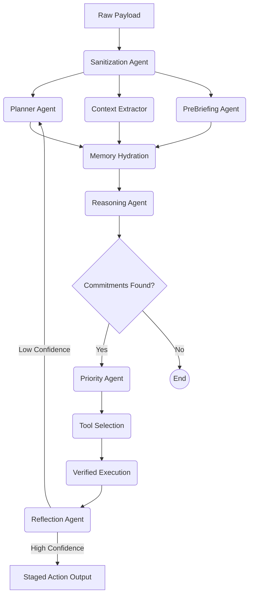

# Oversight.ai

**Proactive AI Productivity Engine**

Oversight.ai monitors your Gmail and Calendar, detects missed commitments, and executes resolutions with one click — powered by a multi-agent orchestrated pipeline on Gemini.

## Why We Built It
Productivity tools traditionally wait for user input. Oversight flips this paradigm. It uses an autonomous 11-stage pipeline (Planner -> Context -> Memory -> Reasoning -> Priority -> Research -> Tool Selection -> Execution -> Verification -> Reflection) to analyze your digital exhaust (emails, calendar) and surface high-confidence, actionable resolutions.

## Architecture

At its core, Oversight.ai is not a wrapper around a single LLM call. It is a strictly typed, **Parallel Directed Acyclic Graph (DAG)** of specialized agents designed to execute concurrently for minimum latency.

## Setup & Deployment

1. Clone the repository.
2. Run `npm install`.
3. Set your environment variables (see `.env.example`).
4. Run `npm run dev`.

*For full deployment instructions, see `ARCHITECTURE.md`.*

## Tech Stack
- **Framework:** Next.js 14 App Router
- **AI/ML:** Google Gemini 2.5 (via Vertex AI / GenAI SDK)
- **Agents:** Custom strictly-typed DAG Orchestrator
- **Auth:** NextAuth (Google OAuth)
- **UI:** Tailwind CSS, Framer Motion, Lucide React
- **Observability:** Custom real-time tracing pipeline with Mission Control UI

## Team Omega
Built by a simulated collective of elite engineers, designers, and AI researchers.
